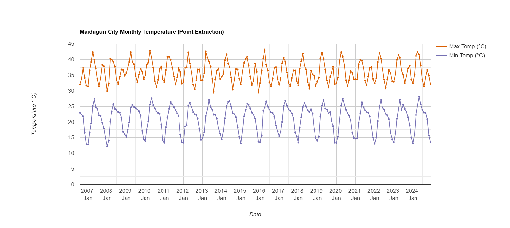
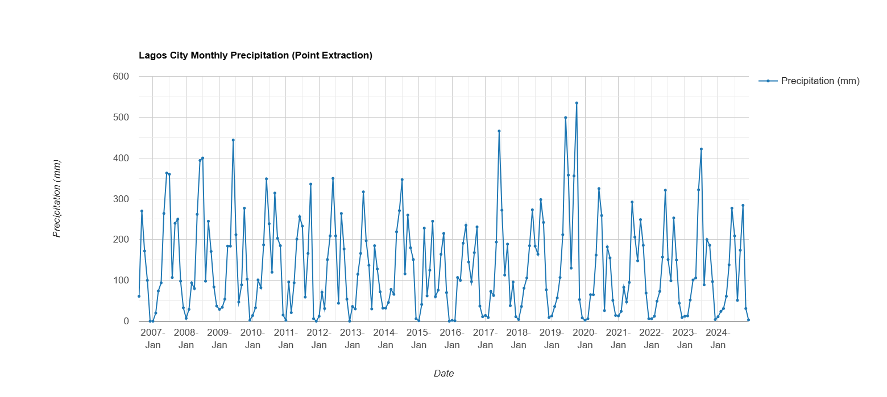

# 🌡️ Subsaharan Africa Climate Dynamics Suite

This repository evaluates two decade-long (2006 to 2026) hydro-thermal climate profiles in Sub-Saharan Africa using **IDAHO_EPSCOR/TERRACLIMATE** high-resolution monthly climate data processed via Google Earth Engine (GEE).

The analysis evaluates two contrasting agro-ecological and climatic extremes in Nigeria:
* **Sudano-Sahelian Thermal Maximums (Maiduguri City, Borno State):** Tracking extreme monthly maximum (`tmmx`) and minimum (`tmmn`) temperature variations in an arid Northern urban hub.
* **Coastal Atlantic Precipitation Patterns (Lagos City, Lagos State):** Evaluating monthly cumulative rainfall dynamics (`pr`) in a tropical coastal megacity.

## 📊 Study Area Coordinates & Datasets

| Location | Coordinates (Lon, Lat) | Primary Metric Assessed | Dataset Used |
| :--- | :--- | :--- | :--- |
| **Maiduguri City** | `[13.1500, 11.8333]` | Monthly Max & Min Temp (°C) | TerraClimate (`tmmx`, `tmmn`) |
| **Lagos City** | `[3.3792, 6.5244]` | Monthly Total Precipitation (mm) | TerraClimate (`pr`) |

## 🔬 Processing Pipeline & Band Scaling

Raw TerraClimate temperature bands (`tmmx` and `tmmn`) are stored as integers with a scale factor of **0.1**. A custom transformation function applies the $0.1$ multiplier to convert raw values into actual degrees Celsius (°C):

```javascript
// Function to scale temperatures and isolate precipitation
var prepClimate = function(image) {
  var maxTempC = image.select('tmmx').multiply(0.1).rename('temp_max_c');
  var minTempC = image.select('tmmn').multiply(0.1).rename('temp_min_c');
  var precip = image.select('pr').rename('precipitation_mm');
  return image.addBands([maxTempC, minTempC, precip]);
};
```


## 📈 Visual Outputs & Time Series Trends
### 1. Maiduguri City Monthly Temperature (2006–2026)


### 2. Lagos City Monthly Precipitation (2006–2026)


💻 Interactive Code & ReproductionInteractive GEE Code Editor Link: 
** 🔗 [Run Script in Google Earth Engine](https://code.earthengine.google.com/47a9a87c1bff6bfbeee0f73b38f880a9)
Raw Code File:** Access the standalone JavaScript file in [`scripts/gee_terraclimate_extraction.js`](scripts/gee_terraclimate_extraction.js)
🛠️ Tools & Data Attribution
Processing Engine: Google Earth Engine (GEE JavaScript API)
Dataset: TerraClimate (IDAHO_EPSCOR/TERRACLIMATE) — University of Idaho / Climatology Lab
Spatial Resolution: ~1/24th degree (~4,638m / 4.6km grid)
Author: Abiodun Iyanda
  var precip = image.select('pr').rename('precipitation_mm');
  return image.addBands([maxTempC, minTempC, precip]); 

